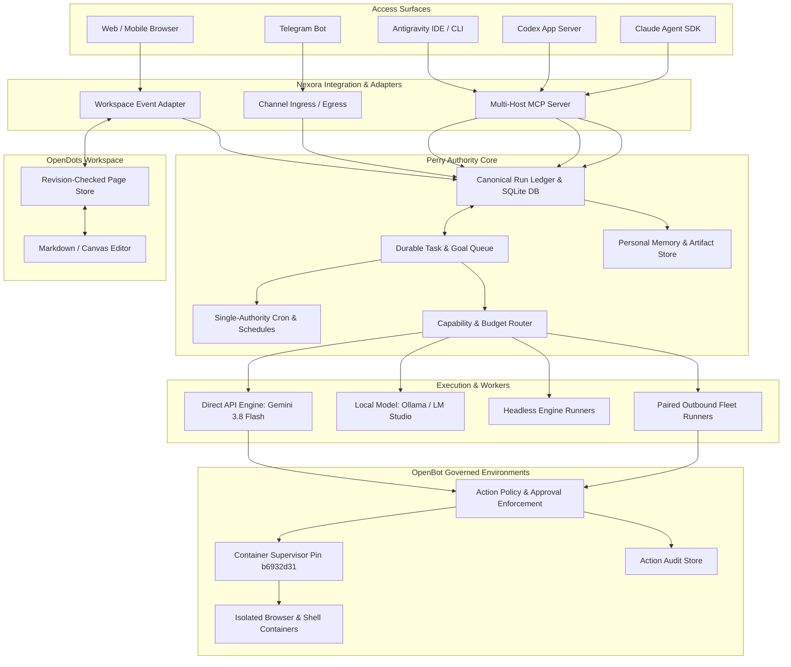
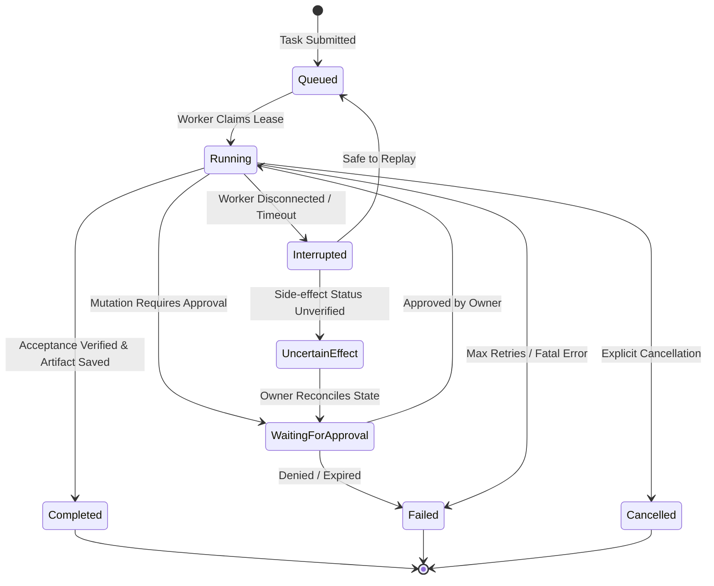

# Nexora Architecture Specification

## 1. System Overview

Nexora is a hybrid personal agent system unifying:
- **Perry** as the durable execution runtime, task ledger, scheduler, runner fleet, and personal memory authority.
- **OpenDots** as the interactive workspace, revision-checked document canvas, and review UI.
- **OpenBot** as the governed container computer execution environment with granular action policies and audit logging.
- **Direct API & Multi-Host Adapters** providing model routing (free-only Gemini 3.8 Flash, local inference) and bi-directional integration with Antigravity, Codex, and Claude.

## 2. Component Ownership and Isolation Contracts

| Subsystem | Owner | Primary Responsibilities | Strict Boundary Rules |
| :--- | :--- | :--- | :--- |
| **Run Ledger & Tasks** | Perry | Task queue, state machine, idempotency keys, worker claims/leases, execution cursors | Single writer per task claim; stores opaque session IDs |
| **Document Canvas** | OpenDots | Page hierarchy, optimistic concurrency (`version`), TipTap markdown editing | Perry references page IDs and hashes; does not duplicate page markdown in task state |
| **Governed Computers** | OpenBot | Docker container lifecycle, per-agent HMAC credentials, browser/terminal isolation | Bounded strictly to Docker containers; low-level computer endpoints never exposed over public network |
| **Model Routing** | Nexora | Model capability matrix, cost reservation, free-only enforcement, 429 backoff | Enforces strict free-only mode: zero paid fallback, zero credit overages |

## 3. Canonical Identifiers and Run Lifecycle

### Canonical Identifiers
- `owner_id`: Unique identifier of the authenticated user.
- `project_id`: Project namespace (e.g. `nexora-default`).
- `agent_id`: Logical agent role or worker identity.
- `task_id`: Durable specification of a unit of work.
- `run_id`: Specific execution attempt of a task, monotonically sequenced.
- `page_id`: OpenDots document identifier with `version` counter.
- `computer_id`: OpenBot container instance ID with isolated workspace/profile volume.

### Run State Machine

## 4. Model & Budget Policy

1. **Free-Only Enforcement**:
   - Primary model: `gemini-3.8-flash` via official Gemini API / SDK using `GEMINI_API_KEY`.
   - Paid fallbacks: **Strictly Disabled**.
   - Automatic credit overages: **Strictly Disabled**.
   - Unknown pricing: Classified as non-free and blocked.
2. **Quota & Rate Limits**:
   - Honor HTTP 429 and `Retry-After` headers.
   - Bounded exponential backoff with jitter; queue exhausted tasks rather than failing them.
3. **Budget Reservation**:
   - Before executing a turn, reserve maximum token quota. Reconcile actual consumption upon turn completion.

## 5. Security & Governance Invariants

- **Approval Binding**: Every approval token binds:
  `HMAC(action_name, arguments_hash, target_resource, run_id, actor_id, policy_version, expiry_timestamp)`
  Any mutation to arguments or expired token forces re-evaluation.
- **Network Boundaries**:
  - Development services bind strictly to `127.0.0.1`.
  - Remote workers connect **outbound** via TLS / WebSocket with revocable pairing tokens.
  - No SQLite database file is ever mounted or shared across a network filesystem.
